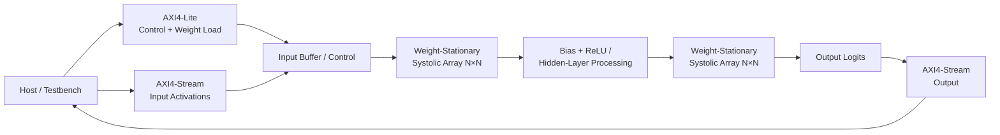

# Parameterized Weight-Stationary Systolic Array for FPGA-Based Neural Network Inference

A parameterized SystemVerilog accelerator implementing a weight-stationary systolic-array GEMM datapath for quantized neural-network inference on a Xilinx Zynq-7000 FPGA.

> **Demonstration workload:** the included Iris 4→16→3 MLP is used purely as a compact end-to-end test workload. It is not the architectural target of the accelerator.

## Why this project

This project explores the hardware architecture behind small matrix multiplications rather than a dataset-specific ML application. The implementation combines parameterized RTL, systolic dataflow, fixed-point arithmetic, AXI interfaces, cycle-level control, FPGA implementation, and hardware/software verification.

## At a glance

| Dimension | Current implementation |
|---|---|
| Dataflow | Weight-stationary |
| Array | 4×4 PEs |
| Parallel MAC capacity | 16 MACs/cycle |
| Operand precision | signed INT8 |
| Accumulation | signed INT32 |
| FPGA | AMD/Xilinx Zynq-7000 XC7Z020 |
| Board | Avnet ZedBoard |
| Clock target | 100 MHz |
| Interfaces | AXI4-Lite + AXI4-Stream |
| Demonstration model | 4→16→3 MLP, with bias and ReLU |

## Results and implementation evidence

The repository preserves Vivado timing, utilization, power, schematic, implementation, and simulation evidence in [`screenshots_project/`](screenshots_project/). The table distinguishes **target/configuration** values from **measured/reported** values; nothing below is inferred or fabricated.

| Metric | Result | Source |
|---|---:|---|
| FPGA | Zynq-7000 XC7Z020 | configuration |
| Board | Avnet ZedBoard | configuration |
| Array | 4×4 (16 PEs) | configuration |
| MACs/cycle | 16 | configuration |
| Operand precision | signed INT8 | configuration |
| Accumulator | signed INT32 | configuration |
| Clock target | 100 MHz (10.0 ns period) | configuration |
| Setup slack (WNS) | +2.488 ns — PASS, 0/3,118 failing endpoints | Vivado timing report |
| Hold slack (WHS) | +0.117 ns — PASS, 0/3,118 failing endpoints | Vivado timing report |
| Reported achievable F_max | ~133 MHz (post-implementation STA; not board-measured) | Vivado timing report |
| LUT utilization | 1,119 / 53,200 (2.10%) | Vivado utilization report |
| FF utilization | 934 / 106,400 (0.88%) | Vivado utilization report |
| DSP48E1 utilization | 16 / 220 (7.27%) | Vivado utilization report |
| Block RAM utilization | 0 / 140 (0.00%, register-only design) | Vivado utilization report |
| Estimated on-chip power | 131 mW (26 mW dynamic + 105 mW static), 26.5°C junction | Vivado power report |
| Demonstration-workload inference latency | 211 cycles = 2.11 μs @ 100 MHz | cycle-accurate RTL simulation |

All timing/power figures are Vivado static analysis and estimation, not on-board measurements. Full breakdowns (critical-path analysis, power by hierarchy, per-phase cycle accounting) are in [`docs/results.md`](docs/results.md).

## Architecture



At the PE level, each processing element stores one weight locally. Activations propagate horizontally while partial sums propagate vertically. Input staggering aligns operands as they enter the array.

### Core computation

```text
psum_out = psum_in + weight_reg × activation_in
```

The array is generated from the configurable row/column parameters rather than manually instantiated as four-by-four hardware.

## Parameterization and scaling

The shared parameter package exposes the principal architectural knobs:

| Parameter | Meaning | Current value |
|---|---|---:|
| `SA_ROWS` | PE rows | 4 |
| `SA_COLS` | PE columns | 4 |
| `ACT_W` | activation width | 8 |
| `WEIGHT_W` | weight width | 8 |
| `PSUM_W` | accumulator width | 32 |

Changing `SA_ROWS`/`SA_COLS` changes the generated PE grid and the systolic timing relationship. The design uses generate loops, so array replication scales with the selected dimensions.

Changing `ACT_W` or `WEIGHT_W` changes operand width throughout the datapath. `PSUM_W` independently controls the accumulation width, allowing wider accumulation than the input operands.

Importantly, **network dimensions and physical array dimensions are separate concepts**. The demonstration MLP is 4→16→3, while the physical array is 4×4. A larger GEMM is handled through tiling/multiple array traversals rather than implying that the neural-network dimensions are fixed to four.

A natural next experiment is a parameter sweep over array dimensions and precision to quantify throughput, area, timing, and power tradeoffs.

## Demonstration workload: Iris MLP

The Iris dataset is intentionally used only as a **small proof-of-concept workload** because it makes the complete pipeline easy to inspect:

```text
Python model
   ↓
quantization / parameter export
   ↓
.memory initialization files
   ↓
SystemVerilog accelerator
   ↓
cycle-accurate verification
   ↓
FPGA synthesis / implementation
```

The network is a 4→16→3 MLP with ReLU in the hidden layer and **bias enabled**. The classifier demonstrates the accelerator; it does not define the accelerator architecture.

## RTL structure

```text
rtl/
├── params_pkg.sv          Shared parameters and types
├── pe.sv                  Single weight-stationary processing element
├── systolic_array.sv      Generated N×N PE grid and input staggering
├── controller.sv          Inference FSM and layer sequencing
├── axi_lite_slave.sv      AXI4-Lite control / weight interface
├── axis_input_slave.sv    AXI4-Stream activation input
├── axis_output_master.sv  AXI4-Stream output interface
├── bram_wrapper.sv        Memory wrapper used by the current RTL
└── ml_accel_top.sv        Top-level integration
```

## Control and latency

The controller sequences loading, GEMM execution, hidden-layer processing, the second GEMM, and output completion. The testbench also records phase-level cycle counts so that compute and interface overhead can be distinguished.

The current clock target is 100 MHz. Exact end-to-end latency should be reported from the final cycle-accurate simulation evidence rather than copied as an architectural constant.

## Verification

The repository uses a cycle-accurate SystemVerilog verification environment: a directed test vector exercised through AXI-Lite/AXI-Stream protocol transactions, internal state monitoring, phase-level cycle accounting, and a hardware-side comparison against a golden expected result.

This is not a UVM environment. A future extension could introduce a conventional UVM agent/driver/monitor/sequencer/scoreboard architecture, but that is future work, not current functionality.

See [`docs/verification.md`](docs/verification.md).

## Design tradeoffs

### Why weight-stationary?

Keeping weights in PE-local registers exposes a simple reuse pattern while activations and partial sums move through the array. For the compact dense workload, this keeps the dataflow straightforward and reduces repeated weight movement through the compute fabric.

### Why INT8 operands and INT32 accumulation?

INT8 operands reduce storage and arithmetic width, while INT32 accumulation provides substantially more headroom for chained products. The choice therefore balances datapath cost against numerical range.

### Why registers at the current scale?

The demonstration workload is small enough that a register-based weight store avoids introducing a larger memory subsystem. This is a workload-specific engineering tradeoff, not a claim that registers are the preferred storage for larger accelerators.

### Why parameterize the array?

A fixed 4×4 design would demonstrate systolic computation; a parameterized design also exposes architectural scaling and allows controlled exploration of PE count, latency, and resource tradeoffs.

See [`docs/design_tradeoffs.md`](docs/design_tradeoffs.md).

## Reproducibility

1. Install the Python dependencies.
2. Run the model training/quantization/export flow.
3. Generate the model initialization files.
4. Compile the SystemVerilog RTL and testbench.
5. Run simulation and compare results with the expected reference behavior.
6. For FPGA implementation, target the Zynq-7000 XC7Z020 in Vivado.
7. Preserve the generated timing, utilization, power, and implementation reports alongside the simulation evidence.

See [`docs/reproducibility.md`](docs/reproducibility.md).

## Known limitations

- The current proof-of-concept workload is a small MLP rather than a large accelerator benchmark.
- The current memory system is intentionally simple and does not implement a high-throughput external-memory hierarchy.
- The project does not yet provide a systematic sweep of larger arrays and workloads.
- Verification is not presented as exhaustive protocol/corner-case coverage.
- The current quantization flow is a compact demonstration pipeline rather than a complete quantization-aware-training framework.

These are deliberate scope boundaries for the present implementation.

## Future work

- Automated sweeps over `SA_ROWS`, `SA_COLS`, and precision.
- Larger GEMM/MLP workloads with throughput/latency benchmarking.
- BRAM-backed weight storage and buffering.
- AXI DMA integration.
- INT4/INT8 mixed-precision studies.
- Formal assertions for control invariants and AXI protocol behavior.
- Full constrained-random UVM verification if verification scope is expanded.
- Quantization-aware training and accuracy/resource tradeoff analysis.

See [`docs/future_work.md`](docs/future_work.md).

## Evidence

- Architecture: [`screenshots_project/systolic_array_architecture.jpeg`](screenshots_project/systolic_array_architecture.jpeg)
- Schematic: [`screenshots_project/schematic.jpeg`](screenshots_project/schematic.jpeg)
- Simulation: [`screenshots_project/simulation.jpeg`](screenshots_project/simulation.jpeg)
- Implementation: [`screenshots_project/implementation.jpeg`](screenshots_project/implementation.jpeg)
- Utilization: [`screenshots_project/utilization_rpt.jpeg`](screenshots_project/utilization_rpt.jpeg)
- Timing: [`screenshots_project/timing_rpt.jpeg`](screenshots_project/timing_rpt.jpeg)
- Power: [`screenshots_project/power_rpt.jpeg`](screenshots_project/power_rpt.jpeg)

A complete screenshot index is available in [`docs/media.md`](docs/media.md).

## References

- Fisher, R. A. (1936), Iris dataset.
- Accellera Systems Initiative, UVM 1.2 documentation.
- AMD/Xilinx, Zynq-7000 SoC documentation.
- Avnet, ZedBoard hardware documentation.

---

**Project focus:** RTL design, FPGA architecture, systolic dataflow, fixed-point arithmetic, hardware/software integration, and verification.
