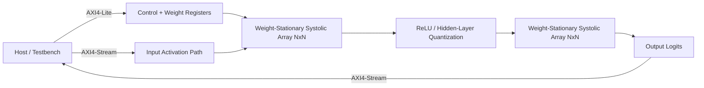

# Architecture

## System-level dataflow

## Processing element

Each processing element (PE) stores one weight locally and performs a signed multiply-accumulate:

`psum_out = psum_in + weight_reg × act_in`

Activations propagate horizontally while partial sums propagate vertically. The array uses input staggering so rows enter the PE grid at the required cycle offsets.

## Parameterization

The shared parameter package exposes the datapath widths and array dimensions. The current demonstration uses:

- `SA_ROWS = 4`
- `SA_COLS = 4`
- `ACT_W = 8`
- `WEIGHT_W = 8`
- `PSUM_W = 32`

Changing the array dimensions changes PE replication and the systolic latency relationship. Changing the precision parameters changes the datapath and accumulator widths. Model dimensions are separately defined from the physical array dimensions; larger GEMMs therefore require tiling/multiple array traversals rather than changing the network's mathematical dimensions directly.

## Why weight-stationary

The dataflow keeps weights resident in the PE registers while activations move through the array. This is a useful choice for the small MLP demonstration because the same weight values participate in repeated MAC operations across the tiled computation, reducing repeated weight movement through the compute fabric.

## Demonstration workload

The 4→16→3 Iris classifier is deliberately treated as a proof-of-concept workload, not as the accelerator's architectural definition. The accelerator is a parameterized GEMM engine; Iris provides a compact end-to-end workload for model training, quantization, weight export, RTL simulation, and FPGA implementation.
